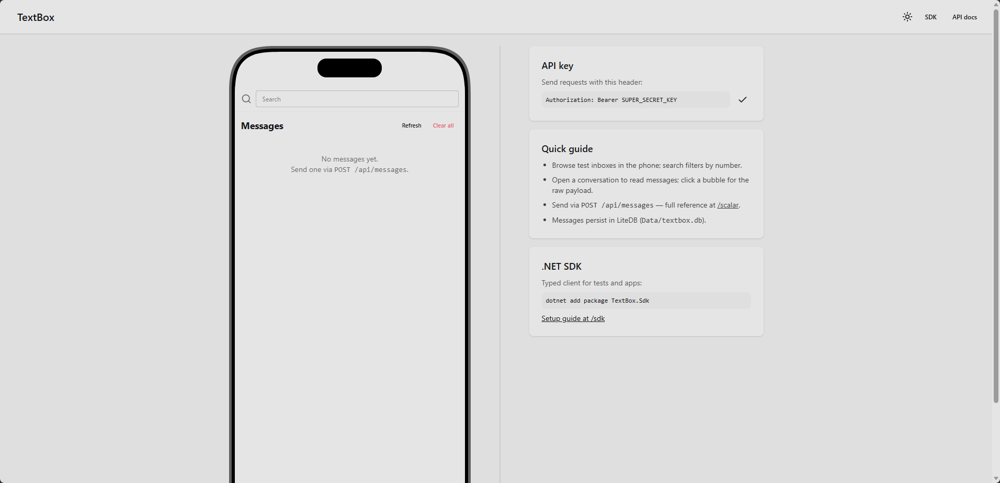
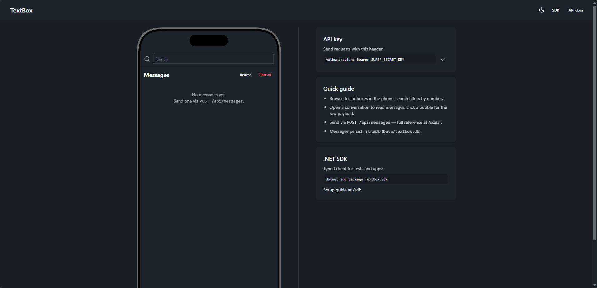

<p align="center"></p>

# TextBox

[](https://github.com/ParsaGachkar/TextBox/actions/workflows/ci.yml)

Simple SMS mocking API + dashboard - C# .NET + Blazor. Ship as a Docker image for local/dev testing and consume via a NuGet SDK.

> **Status: Blazor host + SDK classlib** - `src/TextBox/TextBox.csproj` hosts both the SMS mock API (`/api/messages`) and the dashboard (`/`), `src/TextBox.Sdk/TextBox.Sdk.csproj` is the NSwag-generated NuGet client. `dotnet sln migrate` already run - use `TextBox.slnx`.

## What it does

- **Mock SMS API** - send/list/clear messages without a real provider. LiteDB file persistence (`MessageStore:Path`, default `Data/textbox.db`) with an in-memory read-through cache for tests and local dev.
- **Dashboard** - phone-style Blazor UI (Tailwind CSS + daisyUI): conversations grouped by recipient at `/`, chat view with message-detail popup at `/conversation/{number}`.
- **API docs** - interactive Scalar reference at `/scalar` (OpenAPI at `/openapi/v1.json`).
- **Docker image** - one-command `docker run` for CI or local dev.
- **NuGet SDK** - typed client to integrate tests/apps (`TextBox.Sdk`).

## Screenshots

| Light | Dark |
|---|---|
|  |  |

## Tech Stack

- .NET SDK `10.0.302` (`net10.0` - check `.csproj` `TargetFramework` after scaffolding)
- ASP.NET Core (API) + Blazor (dashboard)
- Tailwind CSS v4 + daisyUI 5 (compiled from `Styles/app.css` on build - needs Node.js; `npm run watch:css` in `src/TextBox` for live rebuilds)
- Scalar API reference (`Scalar.AspNetCore` + `Microsoft.AspNetCore.OpenApi`)
- Rider / Visual Studio

## Prerequisites

- [.NET SDK 10.0.302+](https://dotnet.microsoft.com/download)
- [Node.js](https://nodejs.org/) (for the Tailwind CLI invoked by the build; one-time `npm install` in `src/TextBox`)
- Docker (optional, for image)

Verify: `dotnet --version` -> `10.0.302`

## Getting Started

Single project - build and run immediately:

```powershell
# Build & run (API + dashboard on the same host)
dotnet build TextBox.slnx
dotnet run --project src/TextBox/TextBox.csproj
```

Then open `/` for the phone dashboard, `/scalar` for the interactive API reference, and use `/api/messages` for the mock SMS API:

```powershell
# Send
curl -X POST http://localhost:5000/api/messages `
  -H "Content-Type: application/json" `
  -d '{"to":"+123","body":"hello"}'
# List (optional ?to= filter)
curl http://localhost:5000/api/messages
# Clear
curl -X DELETE http://localhost:5000/api/messages
```

## API key auth (send endpoint)

`POST /api/messages` requires an API key when one is configured (reads stay
open). Set it in `appsettings.json` — empty means open:

```json
"ApiKey": {
  "Key": "secret-1"
}
```

```powershell
curl -X POST http://localhost:5000/api/messages `
  -H "Content-Type: application/json" `
  -H "Authorization: Bearer secret-1" `
  -d '{"to":"+123","body":"hello"}'
```

Without a valid key the API returns `401 {"error":"Missing or invalid API key."}`
(enforced through the ASP.NET Core authentication pipeline). The `/scalar`
reference documents the Bearer scheme, and the dashboard shows the
configured key in the side panel, with a copy button.

## Live updates

The dashboard updates in realtime over SignalR (`/hubs/messages`):
`MessageReceived` after each send, `MessagesCleared` after each clear.
No client authentication is required on the hub (local dev mock).

## Tests

xUnit + NSubstitute (unit) + bUnit (Blazor UI) in `tests/TextBox.Tests`:

```powershell
# All tests
dotnet test TextBox.slnx
# Single test
dotnet test TextBox.slnx --filter <TestName>
```

## Docker

Prebuilt image on GHCR (published from `master` — [package page](https://github.com/ParsaGachkar/TextBox/pkgs/container/textbox)):

```powershell
docker pull ghcr.io/parsagachkar/textbox:latest
docker run --rm -p 8080:8080 ghcr.io/parsagachkar/textbox:latest
```

Or build locally:

```powershell
# Build (context is the repo root)
docker build -f src/TextBox/Dockerfile -t textbox .
# Run (dashboard at http://localhost:8080, API docs at /scalar)
docker run --rm -p 8080:8080 textbox
```

The image runs as non-root and listens on `8080`. Persist the LiteDB
file across restarts with a volume (it lives at `/app/Data` by default):

```powershell
docker run --rm -p 8080:8080 -v textbox-data:/app/Data textbox
```

Configure via environment (same keys as `appsettings.json`):

```powershell
docker run --rm -p 8080:8080 `
  -e ApiKey__Key=secret-1 `
  -e MessageStore__Path=/app/Data/textbox.db `
  textbox
```

## CI/CD

`.github/workflows/ci.yml` runs on pushes/PRs to `master`: build, tests,
SDK pack (uploaded as an artifact), then a Docker build. Pushes to `master`
also push the image to `ghcr.io/<owner>/textbox` (`:latest` + `:sha-<commit>`).
Pushing a `textbox-sdk-v*` tag publishes the SDK to NuGet via trusted publishing (OIDC, no stored key).

## Contributing

See [CONTRIBUTING.md](CONTRIBUTING.md). Commit messages and PR titles must
follow Conventional Commits (enforced on PRs by CI).

## NuGet SDK

Typed client (`TextBox.Sdk`, `netstandard2.0`, NSwag-generated) with full setup at `/sdk`:

[](https://www.nuget.org/packages/TextBox.Sdk)

```powershell
dotnet add package TextBox.Sdk
```

Consume (no DI required — the key is optional, omit it when the API is open):

```csharp
var client = new TextBoxClient(new TextBoxOptions
{
    BaseAddress = "http://localhost:8080",
    ApiKey = "secret-1",
});
var sent = await client.SendAsync(SendSmsRequest.Create("+123", "hello"));
var inbox = await client.ListAsync();
```

Or with Microsoft DI: `services.AddTextBoxClient("http://localhost:8080", apiKey: "secret-1");`

Pack / regenerate (contributors):

```powershell
dotnet pack src/TextBox.Sdk/TextBox.Sdk.csproj -c Release
./scripts/Update-OpenApiSnapshot.ps1  # re-export spec (key configured, keeps Bearer scheme)
./scripts/Regen-SdkClient.ps1         # regenerate committed Generated/
./scripts/Set-SdkVersion.ps1 -Version 0.2.0
```

## Project Structure (target)

```
TextBox.slnx  # use .slnx (migrated from .sln via `dotnet sln migrate`)
├── branding-assets/    # logo source (SVG + PNG) + README screenshots
├── src/
│   ├── TextBox/        # Blazor dashboard (/) + SMS mock API (/api/messages)
│   │   ├── Components/ # Blazor UI (Pages/Home.razor = inbox, Pages/Sdk.razor = SDK docs)
│   │   ├── Dockerfile  # multi-stage image (base/build/publish/final), context = repo root
│   │   ├── Endpoints/  # Minimal API (MessageEndpoints)
│   │   ├── Models/     # SmsMessage / SendSmsRequest
│   │   └── Services/   # IMessageStore (LiteDB), options, validators
│   └── TextBox.Sdk/    # NuGet client (NSwag-generated + partials, netstandard2.0)
└── tests/
    └── TextBox.Tests/  # xUnit/NSubstitute unit + bUnit UI tests
```

## Commands

| Task | Command |
|------|---------|
| Verify solution | `dotnet sln TextBox.slnx list` |
| Build all | `dotnet build TextBox.slnx` |
| Run app (API + dashboard) | `dotnet run --project src/TextBox/TextBox.csproj` |
| Run tests | `dotnet test TextBox.slnx` |
| Pack SDK | `dotnet pack src/TextBox.Sdk/TextBox.Sdk.csproj -c Release` |
| Bump SDK version | `./scripts/Set-SdkVersion.ps1 -Version 0.2.0` |
| Refresh OpenAPI snapshot | `./scripts/Update-OpenApiSnapshot.ps1` |
| Regenerate SDK client | `./scripts/Regen-SdkClient.ps1` |
| Seed demo data | `./scripts/Seed-FakeData.ps1 -ApiKey <key> -ClearFirst` |

PowerShell 5.1 on Windows - use `workdir` param in tooling instead of `cd`.

## License

TBD
